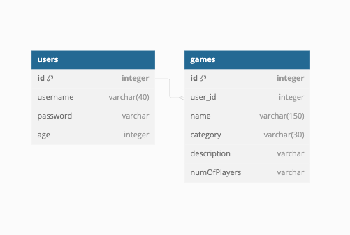

# W11 D4 Sequelize/Express Games EOD

Today, we're creating a simple API (with database) that stores a little info about games and their users!
Feel free to provide your own data entries

This repo already has....
- package.json
- basic express setup
- basic sequelize setup
- .env.example

### Check Server and DB
- Install node modules
- Make .env from example
- Migrate empty sequelize database
- Ensure server runs well

### 1. Add tables for Users and Games to Database
(stop running server)

Create migrations and models for Users and Games referenced in the schema image and listed attributes and constraints below

Users:

    username: string 40, unique, not null, length between 1 - 40
    password: string, not null
    age: integer

Games:

    userId: integer, not null
    name: string, unique, not null, length between 1 - 150
    category: string, not null, length between 3 and 30
    description: string
    numOfPlayers: integer, not null, minimum value 1, default value 1

One user can own many games

If a user is deleted, all games associated with the user are deleted

Migrate tables to DB

### 2. Make seeders for Users and Games

- Add 3 users
- Add 4 games and associate them with users
- Don't forget to validate!

### 3. Communicate with DB through Express
`npm run dev`

You can implement the routes in app.js or a routes directory

Don't forget to import models!

`GET /`
- Find all game posts with their authors

`GET /:gameId`

- Find Game by Id and it's author
- If game isn't found, return message

`POST /new`

- Adding name, category, description, numOfPlayers, and userId to DB

- Check that NOT NULL attributes aren't empty in body
- Be able to find author of the post in database

`PUT /:gameId/edit`
- If game isn't found, return message
- Only update attribute values provided from body
- CANNOT change author

`DELETE /:gameId`
- If game isn't found, return message

### 4. DRY and Refactor - On your own!
